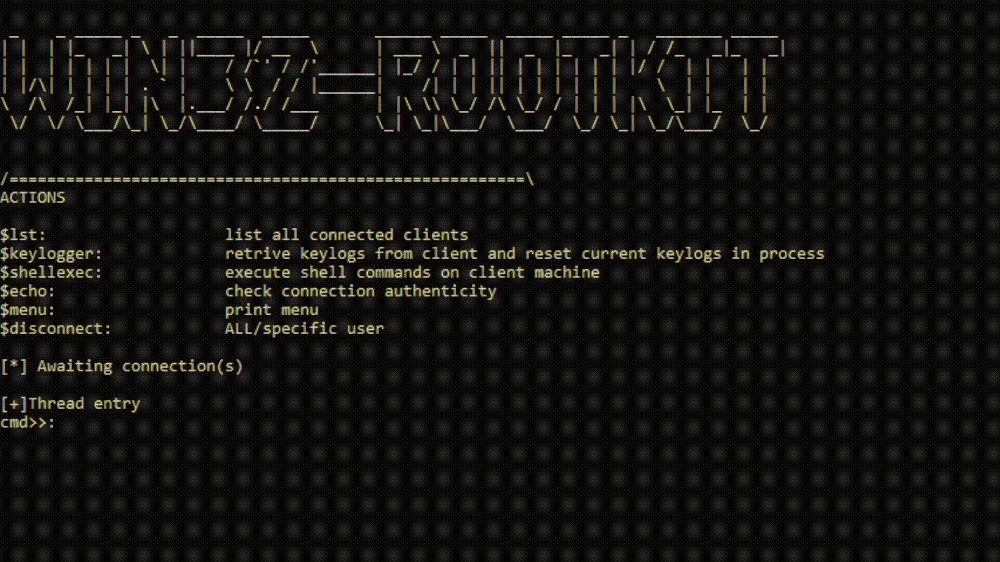

# win32-rootkit

<h2> Windows rootkit that allows for c&c control from multiple clients concurently:</h2>

 
    

<h1>Features</h1>
<ul>
    <li>Persistant multithreaded keylogging</li>
    <li>Automatic reconnectivity incase of disonnection on either side</li>
    <li>Uninterrupted c&c shell execution</li>
</ul>